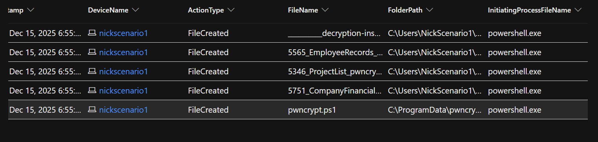

# 🔍 PwnCrypt Zero-Day Ransomware Threat Hunt

## Overview
This project documents a threat-hunting investigation into a simulated zero-day ransomware strain named **PwnCrypt**. The ransomware leverages a **PowerShell-based payload** to encrypt files using **AES-256**, appending a `.pwncrypt` extension to targeted files. The investigation was conducted using **Microsoft Defender for Endpoint (MDE)** telemetry.

This lab simulates how a security operations team might investigate a newly reported ransomware strain using known indicators of compromise (IoCs) and endpoint telemetry.

---

## 🎯 Investigation Objective
The goal of this hunt was to:
- Determine whether the PwnCrypt ransomware executed on an endpoint
- Identify the execution and delivery mechanism
- Assess scope and impact
- Recommend response and prevention actions

---

## 🧠 Hypothesis
Given reports of a new PowerShell-based ransomware strain and an immature security posture lacking user training, it was hypothesized that:
- The ransomware may have executed on an endpoint
- File-based indicators (`*.pwncrypt.*`) would be present
- PowerShell would be used as the primary execution mechanism

---

## 🗂️ Data Sources
The following Microsoft Defender for Endpoint tables were used:
- `DeviceFileEvents`
- `DeviceProcessEvents`

---

## 🔎 Threat Hunting & Analysis

### File System Indicators
A hunt for known IoCs (`*.pwncrypt.*`) revealed three encrypted files:

- `5751_CompanyFinancials_pwncrypt.csv`
- `5346_ProjectList_pwncrypt.csv`
- `5565_EmployeeRecords_pwncrypt.csv`

The original ransomware script, `pwncrypt.ps1`, was also observed in the `C:\ProgramData` directory.

#### 📸 Screenshot: Encrypted File Artifacts

#### Key Observations
- Files were created via **PowerShell**
- Execution occurred under a **non-system user context**
- File creation occurred across multiple directories, including user desktop paths

The consistent use of PowerShell for both payload execution and file encryption suggests a **PowerShell-based ransomware delivery mechanism** rather than a compiled binary.

The change in file locations suggests post-execution activity across multiple directories; however, **no direct evidence of lateral movement** was observed in this dataset.

---

### Process Execution Analysis
Process telemetry showed PowerShell execution closely aligned with encrypted file creation.

- PowerShell processes executed within **10 seconds** of file encryption events
- Command-line artifacts referenced the ransomware payload

#### 📸 Screenshot: PowerShell Process Execution

This temporal correlation strongly indicates that the observed PowerShell execution was responsible for the encryption activity.

---

## 🧾 Timeline Summary

| Timestamp (UTC) | Event |
|----------------|------|
| 2025-12-16 00:55:22 | PowerShell execution observed |
| 2025-12-16 00:55:26 | `.pwncrypt` files created |

#### 📸 Screenshot: Timeline Correlation

---

## 🧭 MITRE ATT&CK Mapping

| Tactic | Technique |
|------|----------|
| Execution | PowerShell (T1059.001) |
| Impact | Data Encrypted for Impact (T1486) |
| Defense Evasion | Execution Policy Bypass (T1562.001) |

---

## 🚨 Response Recommendations
- Isolate the affected endpoint
- Restore impacted files from backups, if available
- Reimage the workstation to eliminate persistence risk
- Restrict PowerShell usage for non-administrative users
- Implement user security awareness training

---

## 🔐 Improvement Opportunities
- Enforce PowerShell Constrained Language Mode
- Monitor for suspicious download-and-execute PowerShell behavior
- Expand proactive threat hunts focused on scripting abuse
- Improve endpoint hardening and user education

---

## 🧪 Tools Used
- Microsoft Defender for Endpoint
- Kusto Query Language (KQL)
- Windows 11 (Lab VM)

---

## 📌 Disclaimer
This project was conducted in a controlled lab environment for educational purposes only.
